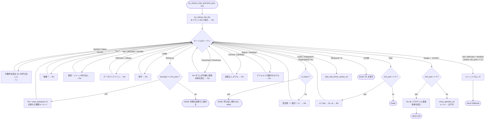
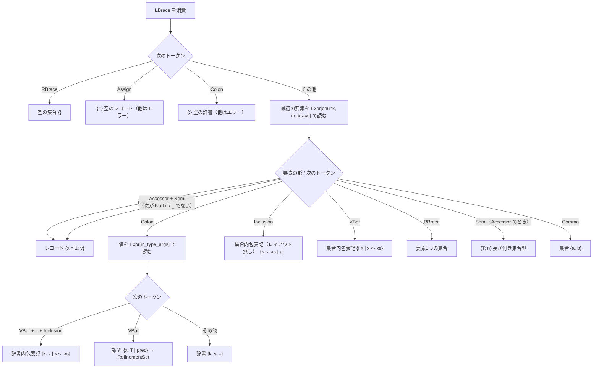
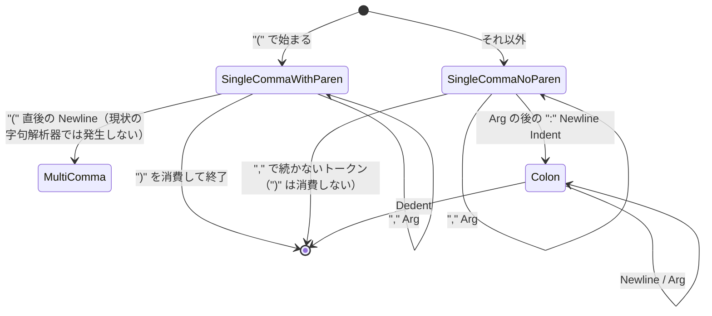

# Erg 簡易文法とパーサーの解析状態

`crates/erg_parser/parse.rs`（および `convert.rs`）の実装が受理する構文を EBNF 風に写し、
解析中にパーサーが持つ「状態」（文脈フラグ・優先順位・カーソルのトークンによる分岐・回復）を整理したもの。
言語仕様の正本は `doc/{EN,JA}/syntax/` であり、本書は **コードを読むための地図** である。
右端の `-- fn` は対応するメソッド名。

関連: [erg_parser-architecture.md](erg_parser-architecture.md)（クレート全体の構成）、
`doc/JA/compiler/phases/02_parse.md`（式解析エンジンの解説）。

---

## 1. 字句上の前提

パーサーは `Lexer` が作るトークン列（`TokenStream`）に対して働く。以下の性質に依存している。

1. **行構造**: Python と同じオフサイドルール。行末は `Newline`、インデントの増減は `Indent` / `Dedent`。
   末尾には必ず `EOF` が付く（`peek()` が `None` を返すのはパーサーのバグとして報告される）。
2. **囲みの内側では改行トークンが出ない**: `( ) [ ] { }` と文字列補間の `\{ }` の内側（`enclosure_level > 0`）では
   `\n` は読み飛ばされ、`Indent`/`Dedent` も生成されない。つまり複数行のリスト・引数列は字句レベルで1行に畳まれる。
   `\` + 改行は行継続。
   パーサー側に残る `line_break` / `ArgsStyle::MultiComma` / 囲み内の `Newline` 処理は、現状では到達しない防御コード。
3. **隣接性**: いくつかの構文はトークンが空白なしで隣接しているか（`col_end == col_begin`）で区別する。

   | 隣接 | 非隣接 |
   | ---- | ------ |
   | `xs[i]` 添字 | `f [i]` リストを引数にした呼び出し |
   | `T\|N\|` 型適用 | `N: Nat \| N >= 1` 篩（ふるい）ガード |
   | `2.5f64` Float リテラル | `2.5 f64` は暗黙の乗算 `2.5 * f64` |
   | `l[0].0` タプル添字（`.0` は `RatioLit` として字句化されるので分解） | — |

   数値リテラルの直後に `Symbol` か `(` が続く暗黙の乗算（`3x` → `3 * x`、`3(x + 1)`）は例外で、隣接を要求しない。

4. **予約語は少ない**: `do` / `do!`、`import` / `pyimport` / `from` / `pyfrom`、`f64` / `f32` は `Symbol` として届き、
   パーサーが内容文字列を見て判別する。`and` / `or` / `in` / `is!` などは演算子トークン。
5. **文字列補間**は字句解析器が `StrInterpLeft`（`"abc\{`）/ `StrInterpMid`（`}abc\{`）/ `StrInterpRight`（`}def"`）に分割済み。
6. インデントは 100 桁まで（CPython と同じ上限）。超えると `indentation is too deep`。

### トークン分類（`TokenCategory`）

| 分類 | トークン |
| ---- | -------- |
| Literal | Nat/Int/Bin/Oct/Hex/Ratio/Bool/Str/None/Ellipsis/Inf リテラル、DocComment |
| UnaryOp | `+` `-` `~` `!` `*` `**` `ref` `ref!`（前置） |
| PostfixOp | `?` |
| BinOp | 上記以外の演算子（§2 の優先順位表を持つもの） |
| SpecialBinOp | `,` `:` `::` `:>` `<:` `.` `\|>` `:=` `<-`（エンジンが個別に扱う） |
| DefOp | `=` |
| LambdaOp | `->` `=>` |
| Separator | `Newline` `;` |
| LEnclosure / REnclosure | `(` `[` `{` `Indent` / `)` `]` `}` `Dedent` |
| Reserved | `^` `&`（現れたら構文エラー） |
| その他 | `@` `\|` `_` `EOF` |

---

## 2. 演算子の優先順位（`TokenKind::precedence`）

数字が大きいほど強く結合する。エンジンが優先順位で比較するのは **BinOp 分類のもの**だけで、
それ以外（`->` `:` `,` `=` など）は「後置構文」として直近のオペランドに結合するか、最外レベル専用として扱われる（§4.3）。

| 優先順位 | 演算子 | 備考 |
| ------: | ------ | ---- |
| 200 | `.` `::` | 属性アクセス（エンジンでは後置構文扱い） |
| 190 | `**` | |
| 180 | 前置 `+` `-` `~` `ref` `ref!` | `try_reduce_unary` は続く **式全体** をオペランドに取る |
| 170 | `*` `/` `//` `%` | |
| 160 | `+` `-` | |
| 150 | `<<` `>>` | |
| 140 | `&&` | |
| 130 | `^^` | |
| 120 | `\|\|` | |
| 100 | `..` `..<` `<..` `<..<` | 範囲 |
| 90 | `<` `>` `<=` `>=` `==` `!=` `in` `notin` `contains` `is!` `isnot!` | 比較。`a < b < c` は `a < b and b < c` に連鎖（§5） |
| 80 | `and` | |
| 70 | `or` | |
| 60 | `->` `=>` `<-` | ラムダは後置構文扱い、`<-` は内包表記専用 |
| 50 | `:` `:>` `<:` `as` | 型注釈（後置構文扱い） |
| 40 | `,` | 括弧なしタプル（`winding` 時のみ） |
| 20 | `=` `:=` | 定義 / デフォルト引数 |
| 10 | `Newline` `;` | |
| — | `\|>` | 表にないが最も弱い。`min_prec == 0` のときだけ消費される |

二項演算子はすべて **左結合**（右オペランドを `try_reduce_expr_prec(op_prec + 1, ctx)` で読む）。
`is_right_associative` は `-> => =` を右結合と定義しているが、これらは後置構文として処理されるためエンジンの優先順位比較には現れない。

---

## 3. 簡易文法（EBNF 風）

記法: `{X}` は 0 回以上、`[X]` は省略可、`ε` は空。`Expr[flag]` は `ExprCtx` のフラグ付きで読むことを表す。
`TypeSpec` と `Pred`（述語）はいずれも **`Expr` として読んでから** `typespec.rs` の `expr_to_type_spec` で型に変換される。

### 3.1 モジュールとブロック

```ebnf
Module   ::= { Sep } { Chunk { Sep } } EOF                          -- try_reduce_module
Sep      ::= Newline | ";"
Block    ::= Expr[winding]                                          -- 同一行         try_reduce_block
           | Newline { Newline } Indent { Sep } Chunk { Sep Chunk } { Sep } Dedent
             (* 最後の Chunk は定義であってはならない（ブロックの値が無くなる） *)
```

`Dedent` の直前の `Newline` は消費されず呼び出し側に残る（呼び出し側がその `Newline` で自分の文を終える）。

### 3.2 文と式

```ebnf
Chunk    ::= ImportSugar | Expr[chunk, winding]                     -- try_reduce_expr(ExprCtx::CHUNK)
Expr     ::= Operand { Tail }                                       -- try_reduce_expr_prec
Tail     ::= BinOp Expr                                             -- 優先順位 >= min_prec のとき。全て左結合
           | "?"                                                    -- 後置エラー伝播
           | "." Name [ Args ] | "::" Name [ Args ]                 -- 属性・メソッド呼び出し
           | "::" "{" RecordBody "}"                                -- データパック  C::{x = 1}
           | "[" Expr "]"                                           -- 添字（このレベルでは隣接不要）
           | ( ":" | "<:" | ":>" | "as" ) TypeSpec [ "|" Pred ]     -- 型注釈。in_brace では Expr を終える
           | ( "->" | "=>" ) Body                                   -- ラムダ: 直前の Operand が引数だった
           | "," TupleRest                                          -- winding: 括弧なしタプル
           | ":=" Expr [ "," TupleRest ]                            -- winding: デフォルト引数  (x, y := 1)
           | "|>" ( CallOrAcc | "." Name Args { Args } )            -- min_prec == 0 のみ
           | Args                                                   -- chunk: `f x` 形（Symbol / Literal が続くとき）
           | "=" Body                                               -- chunk, min_prec == 0: 定義
           | ( "." | "::" | "::" "[" Restriction "]" ) Newline MethodBlock   -- chunk, min_prec == 0
Body     ::= Expr | Block                                           -- `=` の一行本体は winding、`->` は非 winding
```

### 3.3 オペランド

```ebnf
Operand  ::= Literal [ Suffix ]                                     -- try_reduce_bin_lhs
           | NumLit CallOrAcc | NumLit "(" Expr ")"                 -- 暗黙の乗算  3x, 3(x + 1)
           | StrInterp
           | "@" Expr Newline { "@" Expr Newline } Chunk            -- デコレータ付き定義
           | CallOrAcc
           | ( "*" | "**" ) Expr TupleRest                          -- 可変長引数から始まる括弧なしタプル
           | UnaryOp Expr                                           -- + - ~ ! ref ref!
           | "(" ")"                                                -- unit
           | "(" Expr[winding] ")" [ Suffix ]                       -- 括弧 / タプル / (1/2)f64
           | "(" TupleComp ")"
           | "[" ListBody "]"
           | "{" BraceBody "}"
           | "|" TypeArgs "|" Args ( "->" | "=>" ) Block            -- 型パラメータ付きラムダ  |T|(x: T) -> x
           | ( "do" | "do!" ) ( Expr | ":" ( Expr | Block ) )
Suffix   ::= "f64" | "f32"                                          -- 隣接。Float(expr) に脱糖
```

### 3.4 アクセサ連鎖

```ebnf
CallOrAcc   ::= AccChain { Args }                                   -- try_reduce_call_or_acc   f x, f(x)(y)
AccChain    ::= AccHead { Adjacent }                                -- try_reduce_acc_chain     Adjacent は全て隣接
AccHead     ::= Name | "_" | "." Name | "::" Name | "::" "[" Restriction "]" Name   -- try_reduce_acc_lhs
Adjacent    ::= "[" Expr[winding] "]" | "." Name | "." NatLit | "::" Name
              | "(" ArgList ")" | "::" "{" RecordBody "}" | "|" TypeArgs "|"
Restriction ::= "<:" TypeSpec | AccHead                             -- try_reduce_restriction
TypeArgs    ::= "<:" TypeSpec | ArgList[in_type_args]               -- try_reduce_type_app_args
```

`.` / `::` の直後が `Newline`（または `::` の直後が `[`）なら連鎖を終え、§3.2 のメソッドブロックに委ねる。

### 3.5 引数

```ebnf
Args     ::= "(" ")" | "(" ArgList [ "," ] ")"                       -- try_reduce_args
           | ArgList                                                -- 括弧なし  f a, b
           | Arg ":" Newline Indent Arg { Sep Arg } Dedent          -- コロン形式  if cond:  ⏎ a ⏎ b
ArgList  ::= Arg { "," Arg }
Arg      ::= Expr                                                   -- try_reduce_arg
           | Name ":=" Expr | Name ":" TypeSpec ":=" Expr           -- キーワード引数。以降は全てキーワード引数
           | "*" Expr | "**" Expr
           | Name "|" Pred                                          -- 型省略の篩パターン  List(T, N | N >= 1)
```

### 3.6 コレクション

```ebnf
ListBody   ::= ε                                                    -- try_reduce_list_elems
             | Elem ";" Expr                                        -- [x; n]
             | Elem { "," Elem } [ "," "*" Expr ] [ "," ]
             | Name "<-" Expr "|" Pred                              -- レイアウト無しの内包表記
             | Expr "|" Generators
Generators ::= Name "<-" Expr { ";" Name "<-" Expr } [ "|" Pred ]   -- try_reduce_generators
TupleRest  ::= Elem { "," Elem } [ "," ]                            -- try_reduce_nonempty_tuple
Elem       ::= Expr | "*" Expr | Name ":=" Expr | "**" Expr        -- 後2つはパラメータ列として再解釈される前提
TupleComp  ::= Expr "|" Generators | Name "<-" Expr "|" Pred        -- try_reduce_tuple_comprehension

BraceBody  ::= ε | "=" | ":"                                        -- {} {=} {:}      try_reduce_brace_container
             | ( Def | Name ";" ) { Sep ( Def | Name ) } [ Sep ]    -- レコード         try_reduce_record
             | Expr ":" Expr { "," Expr ":" Expr } [ "," ]          -- 辞書             try_reduce_normal_dict
             | Expr ":" Expr "|" Generators                         -- 辞書内包表記
             | Name ":" TypeSpec "|" Pred                           -- 篩型 → RefinementSet
             | Expr { "," Expr } [ "," ]                            -- 集合             try_reduce_set
             | AccHead ";" Expr                                     -- {T; n}  n 要素の集合型
             | Name "<-" Expr "|" Pred | Expr "|" Generators        -- 集合内包表記
```

### 3.7 定義とラムダ（後から再解釈される形）

パーサーは左辺を **普通の式として読んでから** `=` / `->` を見て変換する（`convert.rs`）。
以下は変換が受理する形。

```ebnf
Def        ::= Sig "=" Body                                         -- convert_rhs_to_sig
Sig        ::= Name | Name "|" Bounds "|" | Name "(" ParamList ")" | Pattern | Sig ":" TypeSpec
Pattern    ::= "[" Pat { "," Pat } [ "," "*" Pat ] "]" | "(" Pat { "," Pat } [ "," "*" Pat ] ")"
             | "{" ( Name "=" Pat | Name ) { ";" ... } "}" | Class "::" "{" ... "}" | "_"
Lambda     ::= LamParams ( "->" | "=>" ) Body                        -- convert_rhs_to_lambda_sig
LamParams  ::= Param | "(" ParamList ")" | ParamList                 -- 括弧なしタプルも可
             | Class "(" Args ")" | TypeSpec "or" TypeSpec | TypeSpec "and" TypeSpec   -- 型パターン（束縛しない）
ParamList  ::= Param { "," Param } [ "," "*" Param ] { "," Name ":=" Expr } [ "," "**" Param ]
Param      ::= Name | Literal | Pattern | "ref" Name | "ref!" Name | Param ":" TypeSpec
MethodBlock::= Indent { Sep } Member { Sep Member } { Sep } Dedent   -- try_reduce_class_attr_defs
Member     ::= Def | Name ":" TypeSpec | DocComment
```

### 3.8 その他

```ebnf
ImportSugar ::= ( "import" | "pyimport" ) ModPath [ "as" Name ]      -- opt_reduce_import_sugar
              | ( "from" | "pyfrom" ) ModPath "import" Name [ "as" Name ] { "," Name [ "as" Name ] } [ "," ]
ModPath     ::= StrLit | Name { "/" Name }
StrInterp   ::= StrInterpLeft Expr[winding] { StrInterpMid Expr[winding] } StrInterpRight
                                                                    -- "a\{x}b" → "a" + str(x) + "b"
```

---

## 4. 解析状態

### 4.1 状態を構成するもの

再帰下降パーサーなので「状態」は明示的なテーブルではなく、次の組み合わせで決まる。

| 要素 | 実体 | 誰が変えるか |
| ---- | ---- | ------------ |
| カーソル | `tokens` の先頭（`peek` / `lpop` / `skip`、`restore` で1個押し戻し） | 各メソッド。バックトラックは無い |
| 非終端記号 | 呼び出しスタック上の `try_reduce_*` | `trace!` が debug ログに出す |
| 文脈フラグ | `ExprCtx { chunk, winding, in_type_args, in_brace, line_break }` | 呼び出し時に決まり、再帰で受け渡す（§4.2） |
| 優先順位の下限 | `try_reduce_expr_prec(min_prec, ..)` の `min_prec` | 二項演算子の右オペランドを読むときだけ上がる |
| 引数レイアウト | `ArgsStyle`（`try_reduce_args` のローカル） | §4.5 |
| 定義番号 | `counter: DefId` | 定義・ラムダ・メソッドブロックを作るたびに `inc()` |
| 括弧の記録 | `parenthesized: Set<Location>` | `(a < b)` を読んだとき。比較の連鎖を止めるためだけに使う |
| 診断 | `errs` / `warns` | `fail` / `hint` |

### 4.2 文脈フラグの遷移（誰がどのフラグで `try_reduce_expr` を呼ぶか）

| 呼び出し元 | chunk | winding | in_type_args | in_brace | 意図 |
| ---------- | :---: | :-----: | :----------: | :------: | ---- |
| モジュール / ブロックの文 | ✓ | ✓ | | | 定義・メソッドブロック・`f x` 形・括弧なしタプルを許可 |
| ブロックの一行本体（`=` の右辺） | | ✓ | | | `x = 1, 2` はタプル（`=` < `,`） |
| ラムダの一行本体（`->` の右辺） | | | | | `x -> 1, 2` は `(x -> 1), 2`（`->` > `,`） |
| `(` の中 | | ✓ | | | タプル |
| 添字 `[i]`（隣接） | | ✓ | | | `x[1, 2]` |
| 引数 `Arg` | | | 継承 | | 引数1つ。`\|...\|` 内なら閉じ `\|` を型適用と見ない |
| 型注釈の右辺 | | | 継承* | 継承* | *chunk のときは両方 false に戻す |
| 型適用 `\|...\|`・`::[<: T]`・`k: T := v` の `T` | | | ✓ | | |
| `{` の最初の要素 | ✓ | | | ✓ | `{x = 1}` の定義を読むため chunk、`{k: v}` の `:` を型注釈にしないため in_brace |
| レコードの2要素目以降・辞書の値・メソッドブロックの各行 | ✓ | | | | 定義を許可 |
| 辞書のキー・デフォルト値（`{}` 内） | | | | ✓ / 継承 | |
| リスト要素・内包表記の各部・単項演算子のオペランド | | | | | 素の式 |
| 文字列補間の `\{ }` 内 | | ✓ | | | |

`line_break` は `(` の直後に `Indent` があったときだけ立つが、§1-2 のとおり現状の字句解析器では発生しない。

### 4.3 式エンジンの遷移（`try_reduce_expr_prec`）

オペランドを1つ読んだあと、カーソルのトークンで分岐を繰り返す。`lhs` に結合して続行するもの、
`return` するもの、`break` して呼び出し側に返すものの3種類がある。



- ブロックを導く演算子（`=` `->` `:` …）の直後が入力の終わりなら `ExpectNextLine` を出す。REPL はこれを「続きの入力待ち」と解釈する（`at_eof` は `Dedent` を挟んだ `EOF` も見る）。
- `Assign` と `Dot/DblColon + Newline` が `min_prec > 0` で現れるのは `a + b = ...` のような形で、左に残る演算子が捨てられるため `extra_operator_err`。

### 4.4 `{ ... }` の判別（`try_reduce_brace_container`）

`{` の次と最初の要素の次のトークンで、集合・辞書・レコードを決める。



`{X; Y}`（識別子の後の `;`）はレコードの略記と解釈されるため、識別子だけの集合を `;` 区切りで書くことはできない（コード中の TODO）。

### 4.5 引数レイアウト（`ArgsStyle`）



- コロン形式の中の `,`、および `(` で始めた引数列の中の `:` は「レイアウトの混在」としてエラー。前者はブロック末尾まで読み飛ばす。
- 最初のキーワード引数（`k := v`）以降は `try_reduce_kw_arg` に切り替わり、位置引数が来るとエラー。

### 4.6 ブロックとインデント

```text
f x =⏎             try_reduce_expr_prec が `=` を見る。次が Newline なら try_reduce_block
    a⏎             Newline Indent を消費し、Chunk を Sep 区切りで読む
    b              Newline + Dedent が見えたら Dedent だけ消費し、Newline を残す
⏎                  ← 残した Newline で `f x = ...` の文が終わる
```

- 一行ブロック（`f x = a`）は `Expr[winding]` 1つ。直後が `Dedent` / 区切り / 閉じ括弧でなければ `invalid_chunk` を記録するが、文自体は残す。
- メソッドブロック（`C.` `C::` `C::[T]` + 改行）は同じ形の `try_reduce_class_attr_defs` が読み、各行は定義・宣言・doc コメントに限る。

### 4.7 エラーと回復

エラーは致命的ではなく `errs` に積んで続行する。`Err(())` は「この構文を諦めた」の合図で、
それを受け止めるのはモジュール・ブロック・メソッドブロックの **文ループ** だけ（`if let Ok(expr) = ...` で失敗した文を捨てる）。
それ以外のメソッドは `?` でそのまま上へ返す。

| 回復ヘルパー | 読み飛ばす範囲 | 主な使い手 |
| ------------ | -------------- | ---------- |
| `fail(err)` | 何も飛ばさない | 位置が確定している構造エラー（`expect` 系、`ExpectNextLine` など） |
| `skip_and_throw_syntax_err` / `_invalid_unclosed_err` / `_invalid_seq_err` / `_stream_op_err` | 次の区切り（`Newline` / `;`）まで | 式の中で壊れたとき |
| `expect_or_skip_line` | 行末まで | 閉じ括弧・`<-`・`Indent` の欠落 |
| `skip_and_throw_invalid_chunk_err` | 行末まで（**失敗しない**。文は残す） | 文の後にゴミが続くとき |
| `until_dedent` | ブロック末尾まで | メソッドブロック先頭行が定義でない、コロン形式に `,` |

- `errno`（`Error[#NNNN]` の番号）は **Rust ソースの行番号**（`line!()` / `#[track_caller]`）。parse.rs を編集すると変わるので、出力を比較するときは除外する。
- `hint` は直前に失敗したサブ解析のエラーに補足を付ける（`.map_err(|_| self.hint(..))?`）。

### 4.8 後から再解釈（`convert.rs` / `typespec.rs`）

| 引き金 | 変換 | 対象 |
| ------ | ---- | ---- |
| `=` | `convert_rhs_to_sig` | 左辺の `Expr` → `Signature`（変数 / 関数 / 分配パターン） |
| `->` `=>` | `convert_rhs_to_lambda_sig` | 左辺の `Expr` → `LambdaSignature` |
| `\|T\|(x) ->` | `convert_type_args_to_bounds` + `convert_args_to_params` | 型パラメータ付きラムダ |
| `:` `<:` `:>` `as`、`::[<: T]`、`\|<: T\|` | `expr_to_type_spec` | 型注釈位置の `Expr` → `TypeSpec` |
| `C.` / `C::` + 改行 | `expr_to_type_spec` | メソッドブロックのクラス名 |

変換できない形（例: `f.g(x) = ...`）は `simple_syntax_error` として記録される。
`Expr` の段階で受理されても、ここで初めて構文エラーになる形がある点に注意。

---

## 5. 曖昧さの決め方（早見表）

| 記号 | 候補 | 決め方 |
| ---- | ---- | ------ |
| `:` | 型注釈 / 辞書の key-value / コロン形式の引数 | `in_brace` なら key-value（式を終える）。引数列の中で `Arg` の後に来れば コロン形式。それ以外は型注釈。ただし `:` の直後が `Newline` なら型注釈ではない |
| `\|` | 型適用 `T\|N\|` / 篩ガード `N: Nat \| N >= 1` / 内包表記 `[x \| x <- xs]` / ラムダの型パラメータ `\|T\|(x) ->` | 直前と隣接 → 型適用。`\|` の2つ先が `<-` → 内包表記。オペランド位置で `\|` から始まる → 型パラメータ。それ以外は篩ガード |
| `;` in `{}` | レコードの略記 `{x; y}` / 長さ付き集合 `{T; n}` | `;` の次が `NatLit` / `_` なら長さ付き集合 |
| `,` | 括弧なしタプル / 引数の区切り | `winding` のときだけタプル。引数列の中では区切り |
| `.` `::` | 属性 / メソッドブロック / データパック | 直後が `Newline` → メソッドブロック（文レベルのみ）。`::{` → データパック。`::[` → 可視性制限付き |
| `Symbol` が続く | `f x` 形の呼び出し | 文レベル（`chunk`）のみ。`(x -> x) 1` も文レベルで呼び出し |
| `<` … `<` | 比較の連鎖 | `a < b < c` → `a < b and b < c`。中央は変数かリテラルに限る（2回評価されるため）。`(a < b) < c` は連鎖しない |
| `3x` | 暗黙の乗算 | 数値リテラルの直後に `Symbol` / `(` が続く（空白の有無は問わない。`f64` / `f32` が隣接する場合だけ Float 接尾辞） |
| `do:` | 一行ラムダ | `if c, do: a, do: b` は `do:` が `,` より強く結合し、2つの分岐になる |
| `import x` | 糖衣構文 / 通常の呼び出し | 文レベルで先頭が `import` 等かつ次が名前か文字列 → 糖衣。`import = ...` のような通常利用はそのまま式へ |
